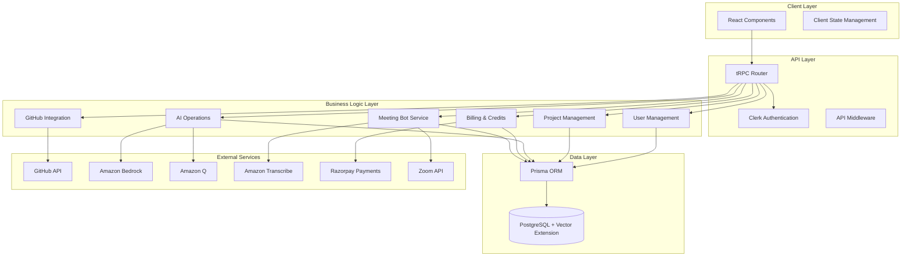

# Design Document: GitHub SaaS Platform

## Overview

The GitHub SaaS Platform is a sophisticated development productivity tool that combines GitHub repository integration, AI-powered code analysis using Amazon Bedrock and Amazon Q, team collaboration, and intelligent meeting assistance. The system architecture follows a modern full-stack approach using Next.js 15 with TypeScript, leveraging tRPC for type-safe API communication, Prisma ORM for database operations, and integrating multiple external services including GitHub API, Amazon Bedrock, Amazon Q, and Razorpay payments.

The platform operates on a credit-based model where users consume credits for AI operations, particularly file indexing and Q&A interactions. The core value proposition centers around semantic code search using vector embeddings generated by Amazon Bedrock, enabling developers to ask natural language questions about their codebases and receive contextually relevant answers with code references powered by Amazon Q.

## Architecture

### System Architecture

The platform follows a monolithic Next.js architecture with clear separation of concerns:



### Technology Stack

**Frontend:**
- Next.js 15 with App Router for server-side rendering and routing
- React 18 with TypeScript for type-safe component development
- Tailwind CSS for utility-first styling
- Radix UI for accessible, unstyled UI primitives
- tRPC client for type-safe API communication

**Backend:**
- Next.js API routes with tRPC for type-safe API endpoints
- Clerk for authentication and user management
- Prisma ORM for database operations and migrations
- AWS SDK for Amazon Bedrock and Amazon Q integration

**Database:**
- PostgreSQL with pgvector extension for vector similarity search
- Prisma schema for type-safe database modeling
- Vector embeddings stored as arrays for semantic search

**External Integrations:**
- GitHub API via Octokit for repository operations
- Amazon Bedrock for AI text generation and embeddings (Claude and Titan models)
- Amazon Q for enhanced code analysis and developer productivity
- Amazon Transcribe for meeting transcription
- Razorpay for payment processing
- Zoom API for meeting bot integration

## Components and Interfaces

### Core Components

#### User Management Component
```typescript
interface User {
  id: string
  clerkId: string
  email: string
  name: string
  credits: number
  createdAt: Date
  updatedAt: Date
}

interface UserService {
  createUser(clerkId: string, email: string, name: string): Promise<User>
  getUserByClerkId(clerkId: string): Promise<User | null>
  updateCredits(userId: string, amount: number): Promise<User>
  getCreditHistory(userId: string): Promise<CreditTransaction[]>
}
```

#### Project Management Component
```typescript
interface Project {
  id: string
  name: string
  githubUrl: string
  userId: string
  isArchived: boolean
  createdAt: Date
  updatedAt: Date
  teamMembers: TeamMember[]
}

interface ProjectService {
  createProject(userId: string, name: string, githubUrl: string): Promise<Project>
  getProjectsByUser(userId: string): Promise<Project[]>
  archiveProject(projectId: string, userId: string): Promise<void>
  inviteTeamMember(projectId: string, email: string): Promise<TeamInvitation>
  acceptInvitation(invitationId: string, userId: string): Promise<void>
}
```

#### AI Service Component
```typescript
interface AIService {
  generateEmbedding(text: string): Promise<number[]>
  generateAnswer(question: string, context: string[]): Promise<string>
  summarizeCommit(commitDiff: string): Promise<string>
  generateMeetingSummary(transcript: string): Promise<MeetingSummary>
  analyzeCodeWithAmazonQ(code: string, question: string): Promise<string>
}

interface BedrockService {
  generateText(prompt: string, model: 'claude-3-sonnet' | 'claude-3-haiku'): Promise<string>
  generateEmbedding(text: string, model: 'titan-embed-text-v1'): Promise<number[]>
}

interface AmazonQService {
  analyzeCode(code: string, context: string): Promise<CodeAnalysis>
  generateDocumentation(code: string): Promise<string>
  suggestImprovements(code: string): Promise<Suggestion[]>
  explainCodeFunction(code: string, functionName: string): Promise<string>
}

interface VectorSearchService {
  indexFile(projectId: string, filePath: string, content: string): Promise<void>
  searchSimilar(projectId: string, query: string, threshold: number): Promise<SearchResult[]>
}
```

#### GitHub Integration Component
```typescript
interface GitHubService {
  validateRepository(url: string, accessToken: string): Promise<boolean>
  getRepositoryFiles(url: string, accessToken: string): Promise<RepositoryFile[]>
  getCommits(url: string, accessToken: string, since?: Date): Promise<Commit[]>
  getFileContent(url: string, path: string, accessToken: string): Promise<string>
}

interface RepositoryFile {
  path: string
  content: string
  sha: string
  size: number
}
```

#### Meeting Bot Component
```typescript
interface MeetingBotService {
  joinMeeting(meetingUrl: string, projectId: string): Promise<MeetingSession>
  startTranscription(sessionId: string): Promise<void>
  stopTranscription(sessionId: string): Promise<Transcript>
  generateSummary(transcript: Transcript): Promise<MeetingSummary>
}

interface TranscriptionService {
  startRealTimeTranscription(audioStream: MediaStream): Promise<string>
  transcribeAudioFile(audioFile: Buffer): Promise<string>
  getTranscriptionConfidence(transcript: string): Promise<number>
}

interface MeetingSummary {
  id: string
  projectId: string
  title: string
  summary: string
  actionItems: ActionItem[]
  keyDecisions: string[]
  participants: string[]
  duration: number
  createdAt: Date
}
```

### API Layer Design

#### tRPC Router Structure
```typescript
export const appRouter = router({
  user: userRouter,
  project: projectRouter,
  github: githubRouter,
  ai: aiRouter,
  amazonQ: amazonQRouter,
  bedrock: bedrockRouter,
  billing: billingRouter,
  meeting: meetingRouter,
})

// User Router
const userRouter = router({
  getProfile: protectedProcedure.query(async ({ ctx }) => { /* ... */ }),
  updateProfile: protectedProcedure.input(updateProfileSchema).mutation(async ({ ctx, input }) => { /* ... */ }),
  getCreditHistory: protectedProcedure.query(async ({ ctx }) => { /* ... */ }),
})

// Project Router
const projectRouter = router({
  create: protectedProcedure.input(createProjectSchema).mutation(async ({ ctx, input }) => { /* ... */ }),
  getAll: protectedProcedure.query(async ({ ctx }) => { /* ... */ }),
  archive: protectedProcedure.input(z.object({ id: z.string() })).mutation(async ({ ctx, input }) => { /* ... */ }),
  inviteTeamMember: protectedProcedure.input(inviteSchema).mutation(async ({ ctx, input }) => { /* ... */ }),
})

// AI Router (Amazon Bedrock Integration)
const aiRouter = router({
  generateEmbedding: protectedProcedure.input(z.object({ text: z.string() })).mutation(async ({ ctx, input }) => { /* ... */ }),
  askQuestion: protectedProcedure.input(askQuestionSchema).mutation(async ({ ctx, input }) => { /* ... */ }),
  summarizeCommit: protectedProcedure.input(z.object({ commitDiff: z.string() })).mutation(async ({ ctx, input }) => { /* ... */ }),
})

// Amazon Q Router
const amazonQRouter = router({
  analyzeCode: protectedProcedure.input(analyzeCodeSchema).mutation(async ({ ctx, input }) => { /* ... */ }),
  generateDocs: protectedProcedure.input(z.object({ code: z.string() })).mutation(async ({ ctx, input }) => { /* ... */ }),
  suggestImprovements: protectedProcedure.input(z.object({ code: z.string() })).mutation(async ({ ctx, input }) => { /* ... */ }),
  explainFunction: protectedProcedure.input(z.object({ code: z.string(), functionName: z.string() })).mutation(async ({ ctx, input }) => { /* ... */ }),
})

// Amazon Bedrock Router
const bedrockRouter = router({
  generateText: protectedProcedure.input(z.object({ prompt: z.string(), model: z.enum(['claude-3-sonnet', 'claude-3-haiku']) })).mutation(async ({ ctx, input }) => { /* ... */ }),
  generateEmbedding: protectedProcedure.input(z.object({ text: z.string() })).mutation(async ({ ctx, input }) => { /* ... */ }),
})
```

## Data Models

### Database Schema

```prisma
model User {
  id        String   @id @default(cuid())
  clerkId   String   @unique
  email     String   @unique
  name      String
  credits   Int      @default(100)
  createdAt DateTime @default(now())
  updatedAt DateTime @updatedAt
  
  projects        Project[]
  teamMemberships TeamMember[]
  creditTransactions CreditTransaction[]
  qaInteractions  QAInteraction[]
  
  @@map("users")
}

model Project {
  id          String   @id @default(cuid())
  name        String
  githubUrl   String
  userId      String
  isArchived  Boolean  @default(false)
  createdAt   DateTime @default(now())
  updatedAt   DateTime @updatedAt
  
  user         User           @relation(fields: [userId], references: [id])
  teamMembers  TeamMember[]
  fileIndexes  FileIndex[]
  commits      Commit[]
  qaInteractions QAInteraction[]
  meetingSessions MeetingSession[]
  
  @@map("projects")
}

model FileIndex {
  id        String   @id @default(cuid())
  projectId String
  filePath  String
  content   String
  embedding Unsupported("vector(1536)")
  sha       String
  createdAt DateTime @default(now())
  
  project Project @relation(fields: [projectId], references: [id])
  
  @@unique([projectId, filePath])
  @@map("file_indexes")
}

model QAInteraction {
  id        String   @id @default(cuid())
  projectId String
  userId    String
  question  String
  answer    String
  context   Json
  createdAt DateTime @default(now())
  
  project Project @relation(fields: [projectId], references: [id])
  user    User    @relation(fields: [userId], references: [id])
  
  @@map("qa_interactions")
}

model MeetingSession {
  id          String   @id @default(cuid())
  projectId   String
  meetingUrl  String
  status      MeetingStatus
  transcript  String?
  summary     Json?
  duration    Int?
  createdAt   DateTime @default(now())
  endedAt     DateTime?
  
  project Project @relation(fields: [projectId], references: [id])
  
  @@map("meeting_sessions")
}

enum MeetingStatus {
  SCHEDULED
  IN_PROGRESS
  COMPLETED
  FAILED
}
```

### Vector Search Implementation

The platform uses PostgreSQL's pgvector extension for efficient similarity search:

```sql
-- Enable vector extension
CREATE EXTENSION IF NOT EXISTS vector;

-- Create index for fast similarity search
CREATE INDEX file_indexes_embedding_idx ON file_indexes 
USING ivfflat (embedding vector_cosine_ops) WITH (lists = 100);

-- Similarity search query
SELECT fi.*, (1 - (fi.embedding <=> $1::vector)) as similarity
FROM file_indexes fi
WHERE fi.project_id = $2
  AND (1 - (fi.embedding <=> $1::vector)) > $3
ORDER BY fi.embedding <=> $1::vector
LIMIT $4;
```

### Credit System Model

```typescript
interface CreditTransaction {
  id: string
  userId: string
  amount: number
  type: 'PURCHASE' | 'CONSUMPTION' | 'REFUND'
  description: string
  metadata: Record<string, any>
  createdAt: Date
}

interface CreditOperation {
  fileIndexing: 1 // 1 credit per file
  qaInteraction: 0 // Free for now
  meetingTranscription: 5 // 5 credits per hour
}
```
## Correctness Properties

*A property is a characteristic or behavior that should hold true across all valid executions of a system—essentially, a formal statement about what the system should do. Properties serve as the bridge between human-readable specifications and machine-verifiable correctness guarantees.*

### User Management Properties

**Property 1: New user credit initialization**
*For any* new user registration, the user should be created with exactly 100 starting credits
**Validates: Requirements 1.2**

**Property 2: Session persistence**
*For any* authenticated user session, the session state should persist across browser restarts and page reloads
**Validates: Requirements 1.4**

**Property 3: User data persistence**
*For any* user data operation, the data should be correctly stored in and retrievable from the PostgreSQL database
**Validates: Requirements 1.6**

### Project Management Properties

**Property 4: Project creation validation**
*For any* project creation attempt, the operation should fail if either GitHub repository URL or project name is missing
**Validates: Requirements 2.1**

**Property 5: GitHub repository validation**
*For any* project creation with a GitHub URL, the repository should be validated for accessibility via Octokit before project creation
**Validates: Requirements 2.2**

**Property 6: Project metadata completeness**
*For any* created project, all required metadata (name, repository URL, creation date, owner) should be stored
**Validates: Requirements 2.3**

**Property 7: Soft delete behavior**
*For any* project archival operation, the project should be marked as archived but not physically deleted from the database
**Validates: Requirements 2.4**

**Property 8: Archived project filtering**
*For any* user's project list request, only non-archived projects should be returned by default
**Validates: Requirements 2.5**

**Property 9: Owner-only team management**
*For any* team management operation, only the project owner should be able to add or remove team members
**Validates: Requirements 2.6**

**Property 10: GitHub API data fetching**
*For any* repository data access, the information should be fetched from GitHub API using current repository state
**Validates: Requirements 2.7**

### File Indexing Properties

**Property 11: Credit consumption per file**
*For any* file indexing operation, exactly 1 credit should be consumed per file processed
**Validates: Requirements 3.1**

**Property 12: Vector embedding generation**
*For any* file indexing operation, vector embeddings should be generated using Amazon Bedrock Titan Embeddings model
**Validates: Requirements 3.2**

**Property 13: Vector storage persistence**
*For any* generated vector embedding, it should be stored in PostgreSQL with vector extension and be retrievable
**Validates: Requirements 3.3**

**Property 14: File metadata completeness**
*For any* indexed file, the content, path, and metadata should all be extracted and stored
**Validates: Requirements 3.4**

**Property 15: Incremental indexing efficiency**
*For any* repository update, only modified files should be re-indexed, not the entire repository
**Validates: Requirements 3.5**

**Property 16: Failed indexing credit protection**
*For any* failed indexing operation, no credits should be consumed and descriptive error messages should be provided
**Validates: Requirements 3.6**

**Property 17: Indexing progress tracking**
*For any* indexing operation, the status and progress should be accurately tracked and reported to users
**Validates: Requirements 3.7**

### Q&A System Properties

**Property 18: Similarity threshold enforcement**
*For any* user question, vector similarity search should only return results with similarity score > 0.5
**Validates: Requirements 4.1**

**Property 19: AI answer generation with context**
*For any* question with relevant code context, an AI answer should be generated using Amazon Bedrock Claude model with Amazon Q integration
**Validates: Requirements 4.2**

**Property 20: Response completeness**
*For any* AI-generated answer, it should include relevant code snippets and file references
**Validates: Requirements 4.3**

**Property 21: Q&A persistence**
*For any* saved Q&A interaction, the question-answer pair should be stored and retrievable for future reference
**Validates: Requirements 4.4**

**Property 22: Chronological Q&A ordering**
*For any* user's saved Q&A sessions, they should be displayed in chronological order (newest first)
**Validates: Requirements 4.5**

**Property 23: Q&A usage tracking**
*For any* Q&A interaction, the usage should be tracked for analytics and billing purposes
**Validates: Requirements 4.7**

### Commit Tracking Properties

**Property 24: Commit data fetching**
*For any* repository with new commits, commit data should be fetched via GitHub API
**Validates: Requirements 5.1**

**Property 25: AI commit summarization**
*For any* processed commit, an AI summary should be generated using Amazon Bedrock Claude model
**Validates: Requirements 5.2**

**Property 26: Commit metadata storage**
*For any* processed commit, all metadata (hash, author, timestamp, AI summary) should be stored
**Validates: Requirements 5.3**

**Property 27: Commit update mechanisms**
*For any* repository, commit tracking should work both automatically and on manual user request
**Validates: Requirements 5.5**

**Property 28: Special commit handling**
*For any* merge commit or branch operation, the commit should be processed appropriately without errors
**Validates: Requirements 5.6**

**Property 29: Commit processing resilience**
*For any* commit processing failure, errors should be logged and processing should continue with remaining commits
**Validates: Requirements 5.7**

### Team Collaboration Properties

**Property 30: Team member display completeness**
*For any* project team view, all team members should be listed with their join dates and roles
**Validates: Requirements 6.3**

**Property 31: Invitation email sending**
*For any* team member invitation, an email invitation should be sent to the specified address
**Validates: Requirements 8.1**

**Property 32: Invitation acceptance access**
*For any* accepted invitation, the user should be granted appropriate access to the project
**Validates: Requirements 8.2**

**Property 33: Team member information display**
*For any* team member list, join dates and roles should be displayed correctly
**Validates: Requirements 8.3**

**Property 34: Permission enforcement**
*For any* team member accessing a project, appropriate permissions should be enforced based on their role
**Validates: Requirements 8.4**

**Property 35: Owner member removal**
*For any* project owner, they should be able to remove team members from their projects
**Validates: Requirements 8.5**

**Property 36: Activity tracking**
*For any* team member action, the activity should be tracked for project analytics
**Validates: Requirements 8.6**

**Property 37: Access revocation on departure**
*For any* team member leaving a project, their access should be revoked immediately
**Validates: Requirements 8.7**

### Billing System Properties

**Property 38: Credit pricing consistency**
*For any* credit purchase, the pricing should be calculated at exactly ₹0.75 per credit
**Validates: Requirements 7.1**

**Property 39: Payment processing via Razorpay**
*For any* credit purchase, payment should be processed through Razorpay integration
**Validates: Requirements 7.2**

**Property 40: Immediate balance updates**
*For any* credit consumption, the user's balance should be updated immediately
**Validates: Requirements 7.3**

**Property 41: Insufficient credit protection**
*For any* credit-consuming operation, it should be prevented when user balance is insufficient
**Validates: Requirements 7.4**

**Property 42: Usage history tracking**
*For any* credit transaction, it should be recorded with operation details and be displayable in usage history
**Validates: Requirements 7.5**

**Property 43: Failed payment protection**
*For any* failed payment, no credits should be granted and clear error messages should be provided
**Validates: Requirements 7.6**

**Property 44: Low balance notifications**
*For any* user whose credit balance falls below configurable thresholds, notifications should be sent
**Validates: Requirements 7.7**

### Meeting Bot Properties

**Property 45: Zoom API integration**
*For any* scheduled meeting bot, it should successfully integrate with Zoom API to join meetings
**Validates: Requirements 9.1**

**Property 46: Real-time transcription**
*For any* meeting the bot joins, real-time speech-to-text transcription should be provided
**Validates: Requirements 9.2**

**Property 47: Live transcription display**
*For any* active transcription, it should be displayed to participants with minimal delay
**Validates: Requirements 9.3**

**Property 48: Meeting summary generation**
*For any* completed meeting, a comprehensive AI summary should be generated
**Validates: Requirements 9.4**

**Property 49: Content extraction from transcripts**
*For any* meeting transcript, action items, decisions, and key discussion points should be extracted
**Validates: Requirements 9.5**

**Property 50: Meeting data persistence**
*For any* meeting session, transcripts and summaries should be stored and linked to the appropriate project
**Validates: Requirements 9.6**

**Property 51: Transcription quality indication**
*For any* transcription with poor quality, confidence levels and potential errors should be indicated
**Validates: Requirements 9.7**

**Property 52: Multi-platform support**
*For any* supported meeting platform, the bot should be able to join and transcribe meetings
**Validates: Requirements 9.8**

**Property 53: Fallback transcript upload**
*For any* meeting where bot access is denied, manual transcript upload options should be provided
**Validates: Requirements 9.9**

### Data Management Properties

**Property 54: Database migration integrity**
*For any* schema change, database migrations should be executed correctly via Prisma ORM
**Validates: Requirements 10.3**

**Property 55: Vector search result ranking**
*For any* vector similarity search, results should be returned ranked by similarity score in descending order
**Validates: Requirements 10.4**

**Property 56: Database operation consistency**
*For any* database transaction, data consistency should be maintained across all operations
**Validates: Requirements 10.5**

**Property 57: Database error recovery**
*For any* failed database operation, transaction rollback and error recovery should be provided
**Validates: Requirements 10.7**

### External Service Integration Properties

**Property 58: GitHub API integration**
*For any* repository operation, it should use GitHub API via Octokit for data access
**Validates: Requirements 11.1**

**Property 59: GitHub rate limit handling**
*For any* GitHub API rate limit encounter, appropriate backoff strategies should be implemented
**Validates: Requirements 11.2**

**Property 60: Amazon Bedrock integration**
*For any* AI text generation request, it should use Amazon Bedrock Claude model service
**Validates: Requirements 11.3**

**Property 61: AI service retry mechanism**
*For any* unavailable Amazon Bedrock service, requests should be queued and retried with exponential backoff
**Validates: Requirements 11.4**

**Property 62: Razorpay payment integration**
*For any* payment processing, it should use Razorpay for secure transaction handling
**Validates: Requirements 11.5**

**Property 63: External API response validation**
*For any* external API response, it should be validated before processing
**Validates: Requirements 11.6**

**Property 64: External service error messaging**
*For any* external service failure, meaningful error messages should be provided to users
**Validates: Requirements 11.7**

### Security Properties

**Property 65: OAuth token authentication**
*For any* GitHub repository access, secure OAuth token authentication should be used
**Validates: Requirements 12.2**

**Property 66: Input validation and sanitization**
*For any* user input, proper validation and sanitization should be implemented to prevent malicious inputs
**Validates: Requirements 12.3**

**Property 67: Security event logging**
*For any* security event or potential threat, it should be logged for monitoring purposes
**Validates: Requirements 12.4**

**Property 68: Rate limiting enforcement**
*For any* API endpoint, rate limiting should be implemented to prevent abuse and DoS attacks
**Validates: Requirements 12.6**

## Error Handling

### Error Categories and Strategies

#### External Service Failures
- **GitHub API Errors**: Implement exponential backoff with jitter, cache repository data when possible, provide fallback to cached data
- **AI Service Failures**: Queue requests for retry, implement circuit breaker pattern, provide graceful degradation
- **Payment Processing Errors**: Never grant credits on payment failure, provide clear error messages, support retry mechanisms

#### Database Operation Failures
- **Connection Failures**: Implement connection pooling with retry logic, provide database health checks
- **Transaction Failures**: Ensure atomic operations with proper rollback, log failures for debugging
- **Migration Failures**: Provide rollback scripts, validate migrations in staging environment

#### Authentication and Authorization Errors
- **Invalid Sessions**: Redirect to login with clear messaging, preserve user's intended destination
- **Permission Denied**: Provide specific error messages, suggest appropriate actions
- **Rate Limiting**: Implement progressive delays, inform users of limits and reset times

#### Data Validation Errors
- **Invalid Input**: Provide field-specific error messages, preserve valid input during correction
- **File Processing Errors**: Skip invalid files with logging, continue processing remaining files
- **Vector Search Failures**: Fallback to text-based search, log embedding generation issues

### Error Recovery Mechanisms

#### Automatic Recovery
- Retry failed operations with exponential backoff
- Circuit breaker pattern for external services
- Automatic failover for database connections
- Background job processing for failed operations

#### User-Initiated Recovery
- Manual retry buttons for failed operations
- Alternative input methods when primary fails
- Export/import functionality for data recovery
- Manual transcript upload when bot fails

## Testing Strategy

### Dual Testing Approach

The platform requires both unit testing and property-based testing for comprehensive coverage:

**Unit Tests**: Focus on specific examples, edge cases, and integration points between components. Unit tests validate concrete scenarios and ensure individual components work correctly in isolation.

**Property Tests**: Verify universal properties across all inputs through randomized testing. Property tests validate that the system behaves correctly across the entire input space and catch edge cases that might be missed by example-based tests.

### Property-Based Testing Configuration

**Testing Library**: Use `fast-check` for TypeScript/JavaScript property-based testing with minimum 100 iterations per property test.

**Test Organization**: Each correctness property from the design document should be implemented as a single property-based test with the following tag format:
- **Feature: github-saas-platform, Property 1: New user credit initialization**
- **Feature: github-saas-platform, Property 18: Similarity threshold enforcement**

### Unit Testing Focus Areas

**Authentication Flow Testing**:
- Test successful login redirects to dashboard
- Test session persistence across browser sessions
- Test authentication failure handling

**API Integration Testing**:
- Test GitHub API integration with valid/invalid repositories
- Test AI service integration with various input types
- Test payment processing with different scenarios

**Database Operation Testing**:
- Test CRUD operations for all models
- Test transaction rollback on failures
- Test migration scripts and schema changes

**UI Component Testing**:
- Test dashboard displays correct project information
- Test Q&A interface functionality
- Test credit balance display and updates

### Property-Based Testing Implementation

**User Management Properties**:
```typescript
// Property 1: New user credit initialization
test('Feature: github-saas-platform, Property 1: New user credit initialization', async () => {
  await fc.assert(fc.asyncProperty(
    fc.record({
      clerkId: fc.string(),
      email: fc.emailAddress(),
      name: fc.string()
    }),
    async (userData) => {
      const user = await userService.createUser(userData.clerkId, userData.email, userData.name);
      expect(user.credits).toBe(100);
    }
  ), { numRuns: 100 });
});
```

**Credit System Properties**:
```typescript
// Property 11: Credit consumption per file
test('Feature: github-saas-platform, Property 11: Credit consumption per file', async () => {
  await fc.assert(fc.asyncProperty(
    fc.array(fc.record({
      path: fc.string(),
      content: fc.string()
    }), { minLength: 1, maxLength: 10 }),
    async (files) => {
      const initialCredits = await getUserCredits(userId);
      await indexFiles(projectId, files);
      const finalCredits = await getUserCredits(userId);
      expect(initialCredits - finalCredits).toBe(files.length);
    }
  ), { numRuns: 100 });
});
```

**Vector Search Properties**:
```typescript
// Property 18: Similarity threshold enforcement
test('Feature: github-saas-platform, Property 18: Similarity threshold enforcement', async () => {
  await fc.assert(fc.asyncProperty(
    fc.string(),
    async (query) => {
      const results = await vectorSearchService.searchSimilar(projectId, query, 0.5);
      results.forEach(result => {
        expect(result.similarity).toBeGreaterThan(0.5);
      });
    }
  ), { numRuns: 100 });
});

// Property 12: Vector embedding generation using Amazon Bedrock
test('Feature: github-saas-platform, Property 12: Vector embedding generation', async () => {
  await fc.assert(fc.asyncProperty(
    fc.string({ minLength: 1 }),
    async (text) => {
      const embedding = await bedrockService.generateEmbedding(text, 'titan-embed-text-v1');
      expect(embedding).toBeInstanceOf(Array);
      expect(embedding.length).toBe(1536); // Titan embeddings dimension
      expect(embedding.every(val => typeof val === 'number')).toBe(true);
    }
  ), { numRuns: 100 });
});
```

### Integration Testing Strategy

**End-to-End Workflows**:
- Complete user registration and project creation flow
- Full repository indexing and Q&A interaction flow
- Team collaboration invitation and acceptance flow
- Credit purchase and consumption flow

**External Service Integration**:
- GitHub API integration with real repositories (using test accounts)
- AI service integration with various input types
- Payment processing integration with test payment methods

### Performance Testing Considerations

**Vector Search Performance**:
- Test search response times with large datasets
- Validate embedding generation performance
- Monitor database query performance

**Concurrent User Testing**:
- Test system behavior under multiple simultaneous users
- Validate rate limiting effectiveness
- Test database connection pooling

### Security Testing Requirements

**Input Validation Testing**:
- Test SQL injection prevention
- Test XSS prevention in user inputs
- Test file upload security

**Authentication Testing**:
- Test session security and expiration
- Test OAuth token handling
- Test permission enforcement

The testing strategy ensures comprehensive coverage through the combination of property-based testing for universal correctness guarantees and unit testing for specific scenarios and edge cases.